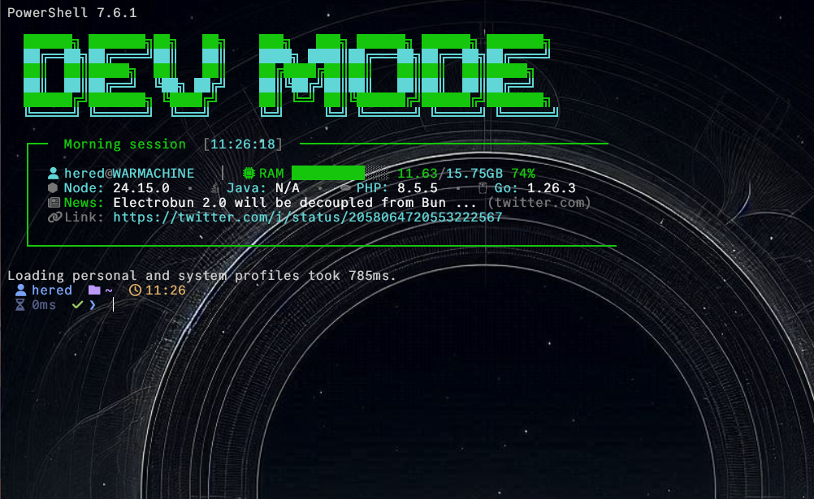

# Devcito Terminal Theme 🚀

Un tema personalizado para **Oh My Posh** con un script de bienvenida tipo "Dashboard" para PowerShell.

 

## 📂 Archivos

El proyecto consta de dos archivos principales que deben estar en tu carpeta de temas (por ejemplo: `~/codes/theme/`):

1.  **`devcito.omp.json`**: Configuración del tema (Prompt minimalista, info flotante, Git, versiones).
2.  **`welcome.ps1`**: Script de inicio con resumen del sistema y noticias tech.

## 🛠️ Instalación y Configuración

### 1. Requisitos Previos
*   **Oh My Posh** debe estar instalado.
*   Una **Nerd Font** instalada y configurada en tu terminal (recomendada: *JetBrainsMono Nerd Font* o *MesloLGS NF*) para ver los iconos correctamente.

### 2. Configurar el Perfil de PowerShell

Para activar el tema y el mensaje de bienvenida, necesitas editar tu perfil de PowerShell.

1.  Abre o crea tu perfil ejecutando en la terminal:
    ```powershell 
    code $PROFILE
    ```

2.  Agrega el siguiente bloque de código. Asegúrate de ajustar las rutas si guardaste los archivos en otro lugar.

    ```powershell
    # ---------------------------------------------------------
    # 🎨 Devcito Theme Configuration
    # ---------------------------------------------------------

    # 1. Iniciar Oh My Posh con el tema
    # Ajusta la ruta si es necesario
    oh-my-posh init pwsh --config "$env:USERPROFILE\codes\theme\devcito.omp.json" | Invoke-Expression

    # 2. Ejecutar Script de Bienvenida (Dashboard)
    # Se recomienda poner esto al FINAL del archivo
    if (Test-Path "$HOME\codes\theme\welcome.ps1") {
        . "$HOME\codes\theme\welcome.ps1"
    }
    ```

3.  Guarda el archivo y reinicia tu terminal (o ejecuta `. $PROFILE` para recargar).

## 🎨 Personalización

### Script de Bienvenida (`welcome.ps1`)
Puedes editar este archivo para cambiar:
*   **Noticias**: Cambia la URL de la API en `Invoke-RestMethod` si prefieres noticias de otra categoría o fuente.
*   **Colores**: Las variables `$c_...` al inicio del script definen la paleta de colores.
*   **Versiones**: Agrega o quita herramientas en la función `Print-Row` o en la sección de versiones.

### Tema (`devcito.omp.json`)
*   Cambia los colores hexadecimales en `"segments"` para ajustar el estilo visual del prompt.
*   Modifica `"template"` para mostrar diferente información.

---
